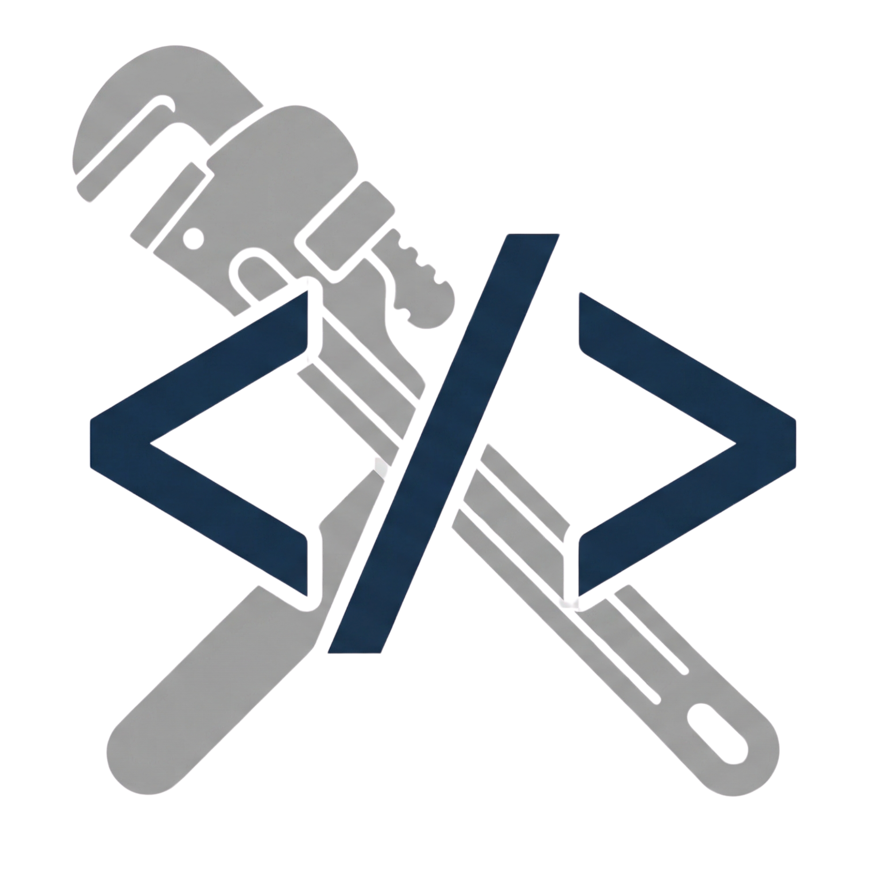

<p align="center">
  
</p>

<h1 align="center">Steam MCP Server</h1>

<p align="center">
  <em>Live Steam API tools for AI-powered IDEs - companion server to <a href="https://github.com/TMHSDigital/Steam-Cursor-Plugin">Steam Developer Tools</a>.</em>
</p>

<p align="center">
  <a href="https://www.npmjs.com/package/@tmhs/steam-mcp"></a>
  <a href="LICENSE"></a>
  <a href="https://www.npmjs.com/package/@tmhs/steam-mcp"></a>
  <a href="https://github.com/TMHSDigital/Steam-MCP/stargazers"></a>
  <a href="https://github.com/TMHSDigital/Steam-MCP/commits/main"></a>
</p>

<p align="center">
  <a href="package.json"></a>
  <a href="https://github.com/TMHSDigital/Steam-MCP#available-tools-v060"></a>
  
</p>

---

<p align="center"><strong>25 MCP tools</strong> - 10 no-auth - 8 API key - 7 publisher key</p>

Query Steam store data, player statistics, achievements, reviews, pricing, workshop items, leaderboards, inventory, and player profiles - all as structured MCP tools callable from Cursor's AI agent.

> **No API key required** for most features. Store lookups, player counts, global achievement stats, news, reviews, and app searches all work out of the box.

## Getting Started

### Prerequisites

- Node.js 18 or later
- npm

### Install

```bash
git clone https://github.com/TMHSDigital/Steam-MCP.git
cd Steam-MCP
npm install
npm run build
```

### Steam API Key

Some tools require a Steam Web API key. Get one free at [steamcommunity.com/dev/apikey](https://steamcommunity.com/dev/apikey).

Set it as an environment variable:

```bash
# Bash / macOS / Linux
export STEAM_API_KEY="your_key_here"

# PowerShell
$env:STEAM_API_KEY = "your_key_here"
```

Or in a `.env` file:

```
STEAM_API_KEY=your_key_here
```

Tools that don't need a key work out of the box with zero configuration.

## Usage with Cursor

Add the Steam MCP server to your Cursor MCP settings (`.cursor/mcp.json` in your project or global settings):

**Via npx (recommended):**

```json
{
  "mcpServers": {
    "steam": {
      "command": "npx",
      "args": ["-y", "@tmhs/steam-mcp"],
      "env": {
        "STEAM_API_KEY": "your_key_here"
      }
    }
  }
}
```

**Via local clone:**

```json
{
  "mcpServers": {
    "steam": {
      "command": "node",
      "args": ["/absolute/path/to/Steam-MCP/dist/index.js"],
      "env": {
        "STEAM_API_KEY": "your_key_here"
      }
    }
  }
}
```

Once configured, the tools are available to Cursor's AI agent. Pair with the [Steam Developer Tools](https://github.com/TMHSDigital/Steam-Cursor-Plugin) plugin for the full skill set.

## Available Tools (v0.6.0) - 25 Total

<details>
<summary><strong>Read Tools (No Auth) - 10 tools</strong></summary>

These work without an API key:

| Tool | Description |
|------|-------------|
| `steam_getAppDetails` | Store data: price, description, reviews, tags, platforms, system requirements |
| `steam_searchApps` | Search for games/apps by name or keyword |
| `steam_getPlayerCount` | Current concurrent player count |
| `steam_getAchievementStats` | Global achievement unlock percentages |
| `steam_getWorkshopItem` | Workshop item details (title, description, tags, subscribers) |
| `steam_getReviews` | Fetch user reviews with filters for language, sentiment, purchase type |
| `steam_getPriceOverview` | Batch price check for multiple apps in a specific region |
| `steam_getAppReviewSummary` | Review score, total counts, and positive percentage (no individual reviews) |
| `steam_getRegionalPricing` | Pricing breakdown across multiple countries/regions |
| `steam_getNewsForApp` | Recent news articles with title, URL, contents, date, and author |

</details>

<details>
<summary><strong>Read Tools (API Key) - 8 tools</strong></summary>

These require `STEAM_API_KEY` to be set:

| Tool | Description |
|------|-------------|
| `steam_getPlayerSummary` | Player profile: name, avatar, online status |
| `steam_getOwnedGames` | Game library with playtime data |
| `steam_queryWorkshop` | Search/browse Workshop items with filters |
| `steam_getLeaderboardEntries` | Leaderboard scores and rankings (pass numeric ID from Steamworks dashboard) |
| `steam_resolveVanityURL` | Convert vanity URL to 64-bit Steam ID |
| `steam_getSchemaForGame` | Achievement/stat schema with display names, descriptions, and icon URLs |
| `steam_getPlayerAchievements` | Per-player achievement unlock status and timestamps |
| `steam_getLeaderboardsForGame` | List all leaderboards with numeric IDs, names, sort methods (partner API) |

</details>

<details>
<summary><strong>Write / Guidance Tools (Publisher Key) - 7 tools</strong></summary>

These require a publisher API key with server IP allowlisted in Steamworks partner settings. SDK-only tools return code examples instead of making HTTP calls.

| Tool | Type | Description |
|------|------|-------------|
| `steam_createLobby` | SDK guide | Returns C++/C#/GDScript code for ISteamMatchmaking lobby creation |
| `steam_uploadWorkshopItem` | SDK guide | Returns code for ISteamUGC Workshop upload workflow |
| `steam_updateWorkshopItem` | HTTP POST | Update Workshop item metadata via IPublishedFileService partner API |
| `steam_setAchievement` | HTTP POST | Set/unlock achievements via ISteamUserStats partner API (dev/test) |
| `steam_clearAchievement` | HTTP POST | Clear/re-lock achievements via ISteamUserStats partner API (dev/test) |
| `steam_uploadLeaderboardScore` | HTTP POST | Upload scores via ISteamLeaderboards partner API |
| `steam_grantInventoryItem` | HTTP POST | Grant inventory items via IInventoryService partner API |

</details>

<details>
<summary><strong>Steam API Endpoints (19 endpoints)</strong></summary>

| Endpoint | Auth |
|----------|------|
| `store.steampowered.com/api/appdetails` | None |
| `store.steampowered.com/api/storesearch` | None |
| `ISteamUserStats/GetNumberOfCurrentPlayers/v1` | None |
| `ISteamUserStats/GetGlobalAchievementPercentagesForApp/v2` | None |
| `ISteamNews/GetNewsForApp/v2` | None |
| `ISteamRemoteStorage/GetPublishedFileDetails/v1` | None |
| `store.steampowered.com/appreviews/{appid}` | None |
| `ISteamUser/GetPlayerSummaries/v2` | API key |
| `IPlayerService/GetOwnedGames/v1` | API key |
| `ISteamUser/ResolveVanityURL/v1` | API key |
| `IPublishedFileService/QueryFiles/v1` | API key |
| `ISteamUserStats/GetSchemaForGame/v2` | API key |
| `ISteamUserStats/GetPlayerAchievements/v1` | API key |
| `ISteamLeaderboards/GetLeaderboardEntries/v1` | Publisher key |
| `ISteamLeaderboards/GetLeaderboardsForGame/v2` | Publisher key |
| `IPublishedFileService/UpdateDetails/v1` (POST) | Publisher key |
| `ISteamUserStats/SetUserStatsForGame/v1` (POST) | Publisher key |
| `ISteamLeaderboards/SetLeaderboardScore/v1` (POST) | Publisher key |
| `IInventoryService/AddItem/v1` (POST) | Publisher key |

</details>

<details>
<summary><strong>Development</strong></summary>

```bash
npm run dev         # Watch mode with auto-reload
npm run build       # Compile TypeScript to dist/
npm start           # Run the compiled server
npm test            # Run all tests (vitest)
npm run test:watch  # Test watch mode
```

See [CONTRIBUTING.md](CONTRIBUTING.md) for how to add new tools and submit PRs.

</details>

## Related

- [Steam Developer Tools](https://github.com/TMHSDigital/Steam-Cursor-Plugin) - Cursor IDE plugin with 30 skills and 9 rules for Steam/Steamworks development

## License

CC BY-NC-ND 4.0 - see [LICENSE](LICENSE) for details.

---

<p align="center">Built by <a href="https://github.com/TMHSDigital">TMHSDigital</a></p>
